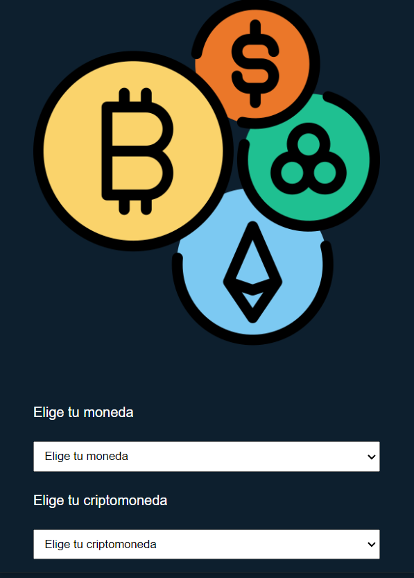
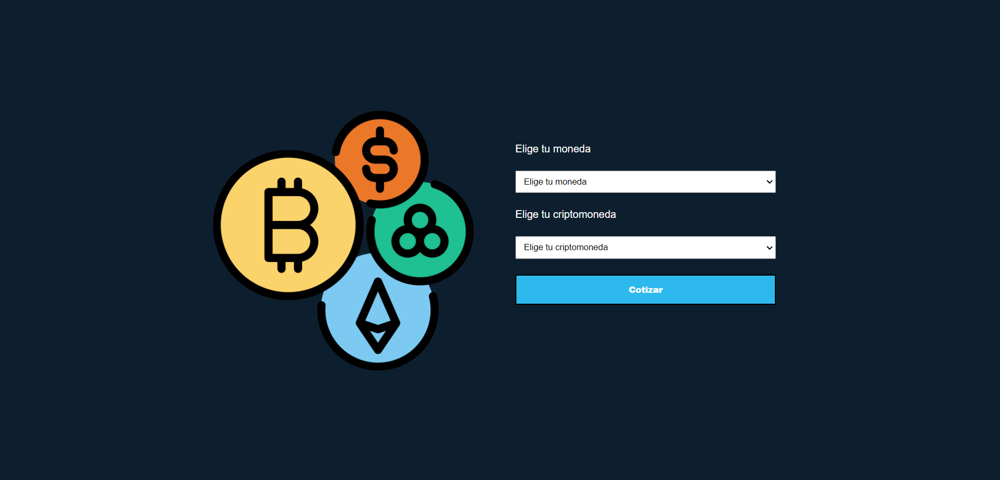
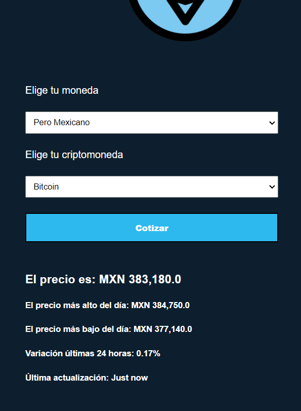
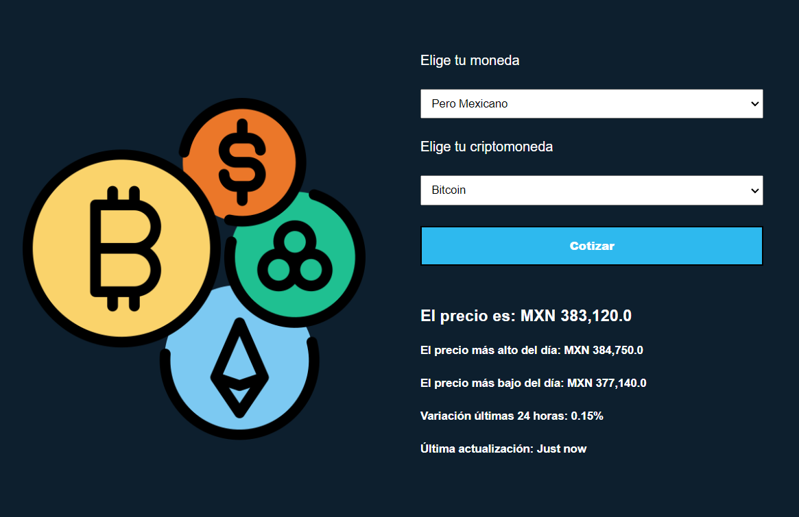

# Cotizador de criptomonedas

## Mobile

## Desktop

## Características

- Busquedas de información gracias a Criptocompare API
- Diseño responsivo
- Obtiene las 10 criptomonedas más valoradas del momento y la guarda en un select
- Conversiones de algunas divisas con la criptomoneda seleccionada

## Mobile Search

## Desktop Search

